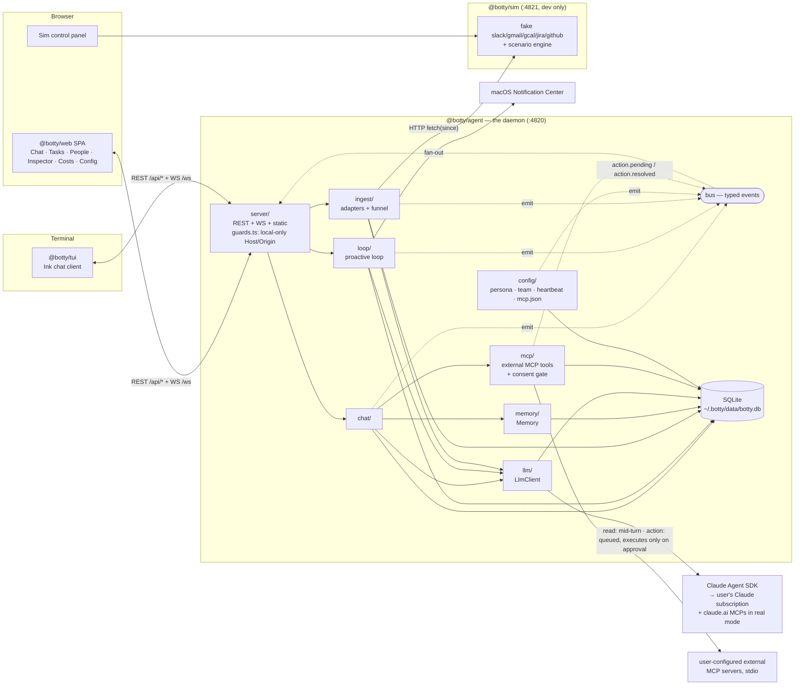
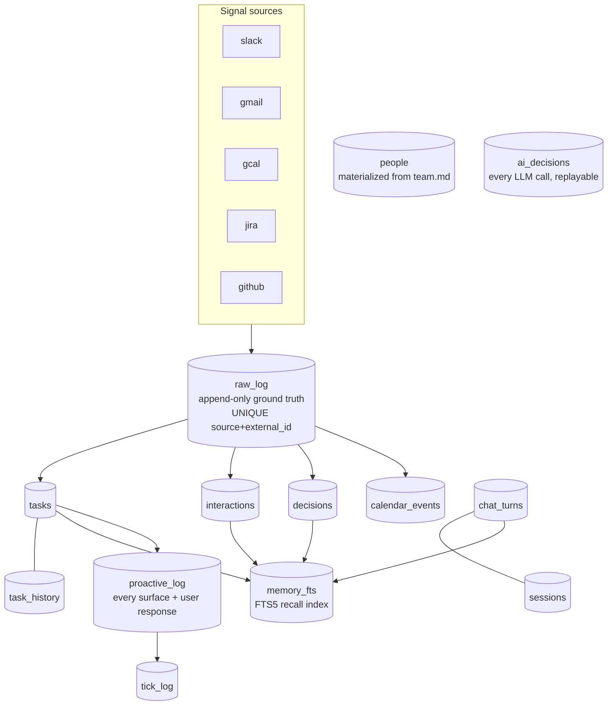
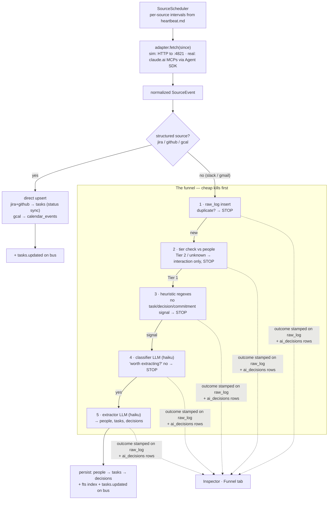
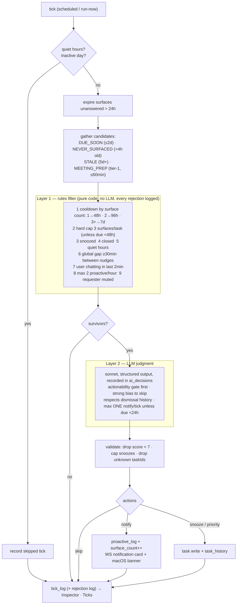
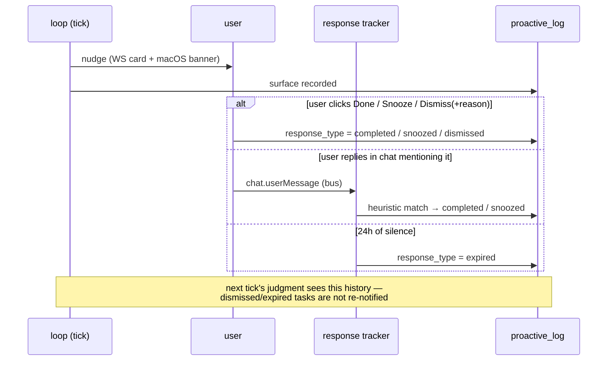
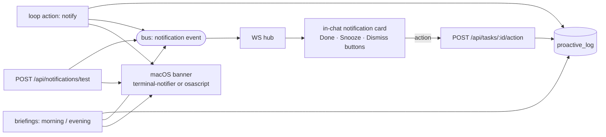
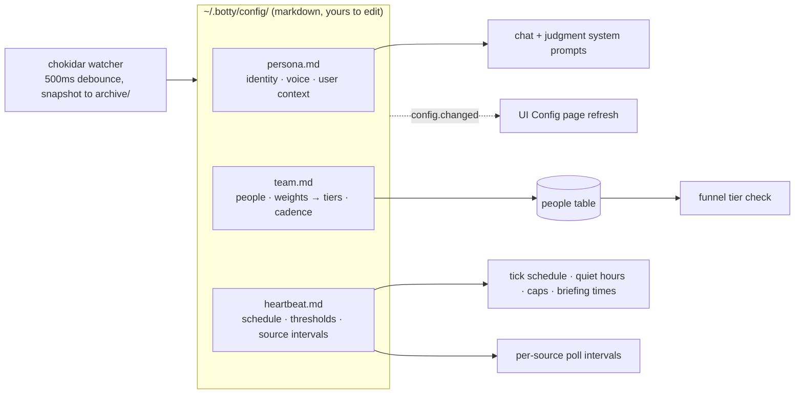
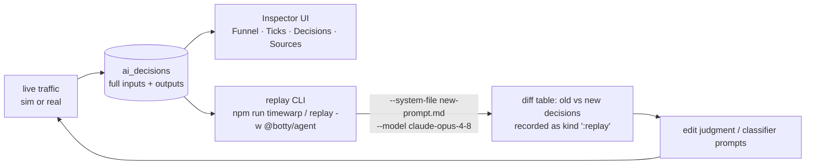

# botty — Architecture

How the pieces fit together, with diagrams that follow the actual code. File paths refer to
`packages/…`. Companion docs: `SPEC.md` (what and why), `docs/specs/*` (per-subsystem contracts),
`TESTING.md` (how to exercise all of this).

## 1. System overview

One daemon, two first-class clients. In normal use that's the agent plus whichever clients you
open — the web SPA in a browser and/or the `@botty/tui` terminal client; the simulator is a
third process in dev/test only.



Key properties:

- **One brain, one DB.** Everything stateful lives in SQLite; the UI is a thin typed client.
- **The bus is the only path to the UI.** Modules never talk to WebSocket clients directly; they
  emit typed `WsEvent`s on the bus (`agent/src/bus/`), the WS hub (`server/ws.ts`) fans out.
- **The LLM is behind one interface.** `LlmClient` (`llm/types.ts`) is the only thing that knows
  the Agent SDK exists. `BOTTY_MOCK_LLM=1` swaps in a deterministic mock.
- **Every AI call leaves a trace.** All `structured()`/`chatTurn()` calls write an `ai_decisions`
  row (full inputs + output + model + latency) — the Inspector and replay CLI read these.

## 2. Where data lives



`raw_log` is the recovery primitive: every normalized inbound event is stored verbatim before
any processing, so the pipeline is re-runnable and every downstream artifact can be traced back
to its source event.

## 3. Ingestion — deterministic fetch, funneled intelligence

Fetching is dumb code; the LLM only appears at steps 4–5, and only for unstructured sources.



Outcomes: `DUPLICATE` · `INTERACTION_ONLY` · `NO_SIGNAL` · `CLASSIFIED_OUT` · `EXTRACTED` ·
`UPSERTED`. The Inspector's Funnel tab answers "why did/didn't this message become a task?" for
every single raw event — this inspectability is the core fix over botito.

**Real mode (M4):** the sim drivers are swapped for adapters that read sources through the
claude.ai MCP connectors (Slack, Gmail, Google Calendar) via the Agent SDK — no standalone
tokens, no Slack app. The MCP read happens strictly inside `adapter.fetch()`; everything after
normalization (dedup, funnel, extraction, task writes) is the same deterministic, raw-logged
pipeline in both modes.

## 4. The proactive loop — two layers, biased to silence

This is the anti-nagging machinery. A tick fires every 20 min (heartbeat.md) or on demand.



And the feedback half — silence is signal:



**Inferred commitments** ride this same tick judgment rather than a separate scheduler: a hidden
post-turn chat pass (`chat/commitments.ts`) notices short-lived follow-ups ("my interview is
tomorrow at 3") and stores them as `commitments` rows — operational state, not tasks, not durable
memory. `loop/commitments.ts` folds due ones into the judgment context (untrusted-content wrapped,
notify-or-skip only) and delivers them through the same notify path above. See `specs/loop.md`.

## 5. Chat — one thread, sessions sealed invisibly

```mermaid
sequenceDiagram
    participant W as web UI
    participant S as server
    participant C as chat service
    participant M as Memory
    participant LL as LlmClient (Agent SDK)
    participant B as bus
    participant D as SQLite

    W->>S: POST /api/chat/message {text}
    S->>C: handleUserMessage(text)
    C->>D: persist user turn
    C->>B: chat.userMessage (feeds response tracker)
    C->>M: buildChatSystemPrompt(text)
    Note over M: persona.md + team summary +<br/>sealed-session summaries +<br/>FTS5 recall hits + open tasks
    C->>LL: chatTurn(sessionKey, prompt, system)
    LL->>D: resume provider session id (if valid)
    loop streaming
        LL-->>B: chat.chunk / chat.thinking / chat.toolUse
        B-->>W: WS fan-out (live render)
    end
    LL->>D: ai_decisions row (chat_turn)
    C->>D: persist assistant turn + FTS index
    C-->>B: chat.done
    Note over C,D: idle > 30 min ⇒ next send seals the session<br/>synchronously (no double-seal); the summary is<br/>generated on the turn queue — not inline in POST —<br/>and lands before the next queued turn's prompt build
```

Resilience in `llm/sdk.ts`: a 120s inactivity watchdog on the SDK stream, and if a *resumed*
session hangs or fails, one automatic retry with a fresh session — but only when the failed
attempt streamed no output (a retry after partial text would duplicate it) and the failure
wasn't the user's own interrupt.

**External MCP tools** are additional chat tools, re-derived every turn from
`~/.botty/config/mcp.json`'s allowlist (`mcp/tools.ts`). `read`-mode tools call straight through
to the MCP server mid-turn like any built-in tool; `action`-mode tools never do — the model can
only enqueue a `pending_actions` row (`mcp/pending.ts`), and the agent's own MCP client only ever
calls the tool on explicit user approval (`POST /api/actions/:id/approve`). See `specs/mcp.md`.

## 6. Notifications — one event, three surfaces

Everything the loop wants you to see flows through a single path:



So "botty told me something" always means: a row in `proactive_log` (auditable), a card in the
chat thread (actionable), and a native macOS banner (attention). `POST /api/notifications/test`
fires the whole path with a canned message.

## 7. Config → behavior



`team.md` is load-bearing: it is simultaneously documentation, the ingestion whitelist (weights
CRITICAL/HIGH ⇒ Tier 1 ⇒ full extraction), and the judgment context about who matters.

## 8. Inspectability & tuning loop



This closes the loop that botito never had: when a nudge felt wrong or a task was missed, you
can see exactly what the model saw, change the prompt, and re-run the last N *real* decisions
before shipping the change.

`ai_decisions` also prices out spend: `GET /api/costs` (`server/costs.ts`) rolls every call up by
activity category (chat/intake/proactive/resolution/briefing/other) and model, at USD/MTok rates
(overridable via the `llm.pricing` setting), over today/7d/30d/all-time windows plus a 30-day
daily series — rendered as the web **Costs** page and the TUI `/costs` panel.
